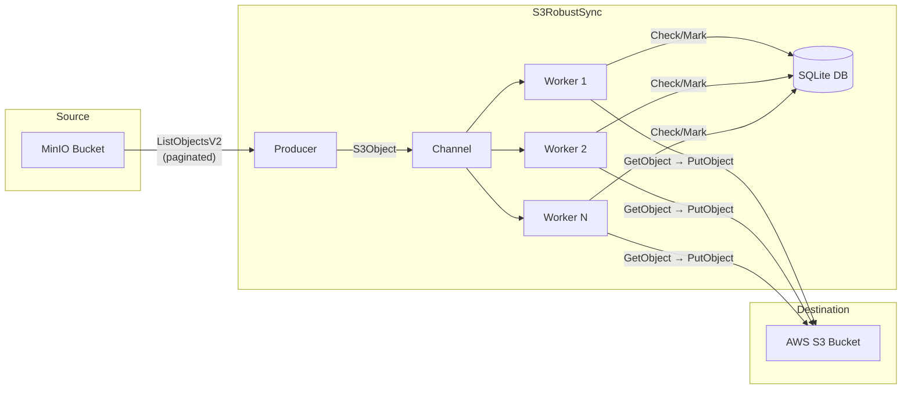
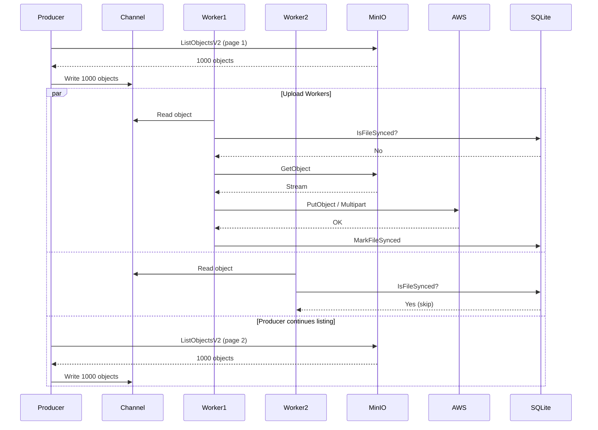
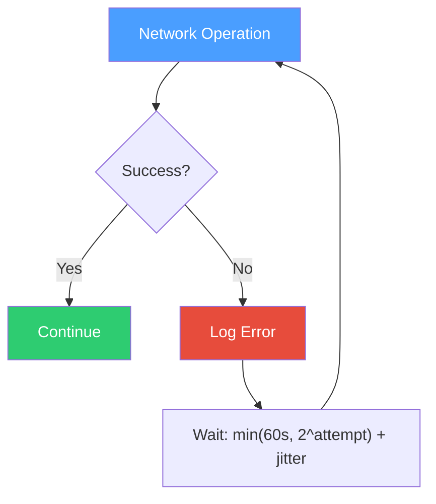
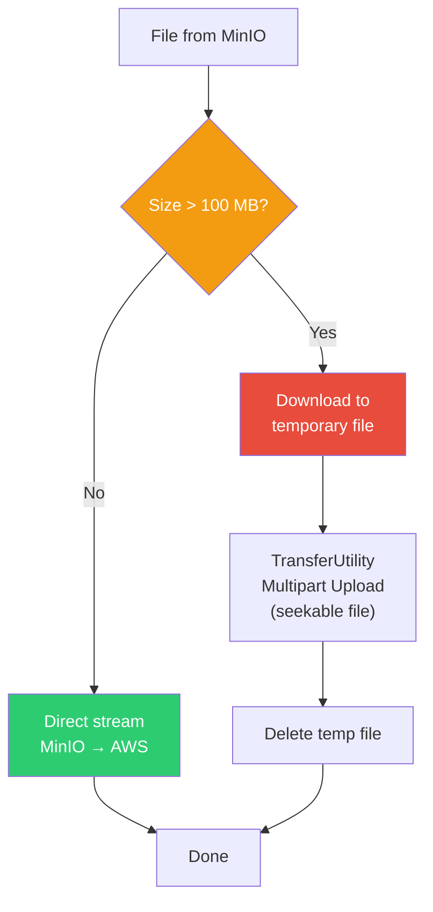
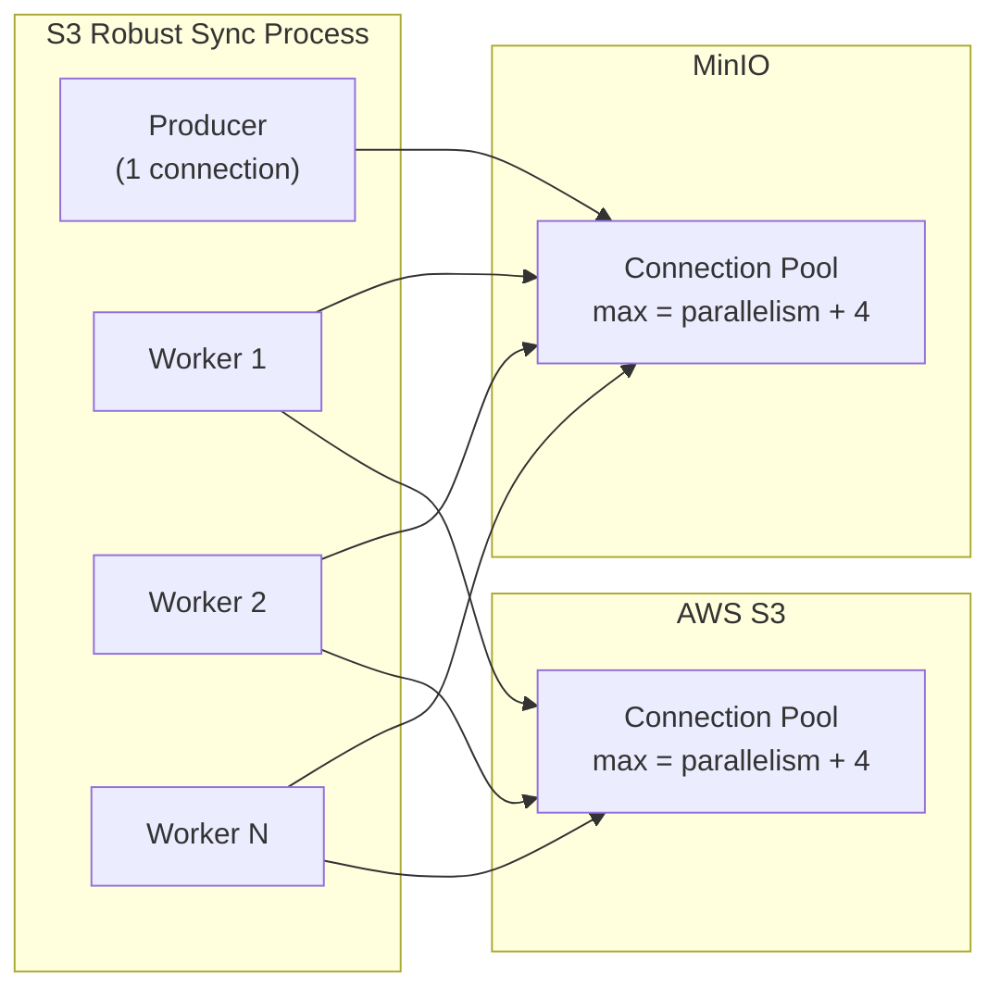

# S3 Robust Sync

S3 Robust Sync is a highly resilient, high-performance command-line utility written in .NET to synchronize massive datasets (millions of files, large objects) from a local MinIO bucket to a remote AWS S3 bucket.

## Key Features

- **Infinite Resilience:** Designed to handle severe network interruptions (even hours of downtime). Uses Polly for exponential backoff retries with jitter. When the internet comes back, the sync seamlessly resumes exactly where it left off.
- **Stateful Deduplication:** Utilizes a local SQLite database with Write-Ahead Logging (WAL) and connection pooling to persistently track successfully transferred objects. On restart, already-synced files are skipped instantly.
- **Pipelined Architecture:** Uses a producer-consumer pipeline built on `Channel<T>`. Listing and uploading happen concurrently — upload workers are never idle waiting for the next MinIO listing call.
- **High-Performance Parallelism:** Transfers multiple files concurrently. HTTP connection pools are automatically scaled to match your parallelism setting.
- **Large File Safety:** Files over 100MB are automatically downloaded to a temporary file before uploading, allowing `TransferUtility` to seek freely for reliable multipart uploads. Smaller files are streamed directly for maximum speed.
- **One-Shot Execution:** Syncs the entire bucket in a single pass and exits cleanly, making it perfect for scripts, cron jobs, or CI/CD pipelines.
- **One-Way Sync:** Only lists files in the local MinIO bucket and pushes them to AWS S3. It never lists or checks the remote AWS bucket, dramatically reducing AWS API costs.
- **Graceful Shutdown:** Properly handles `Ctrl+C` cancellation instead of retrying cancelled operations.
- **Skip SSL Validation:** Supports MinIO instances with self-signed certificates from private CAs via `--skip-ssl` (MinIO connection only; AWS remains fully validated).
- **Log to File:** Optionally tee all output to a log file with `--log-file` for reviewing long-running syncs after the fact.
- **Progress Tracking:** Periodic progress summaries show how many files have been processed, synced, and skipped.

## Prerequisites

- [.NET 10.0 SDK](https://dotnet.microsoft.com/download) (or compatible version)
- Access to a MinIO instance
- AWS Account with S3 PutObject permissions

## Installation

Build from source:

```bash
git clone <repository-url>
cd s3-robust-sync
dotnet build
```

Create a standalone executable:

```bash
# Example for macOS ARM64
dotnet publish -c Release -r osx-arm64 --self-contained true -p:PublishSingleFile=true
```

Cross-platform binaries are also automatically compiled and attached to GitHub Releases via GitHub Actions.

## Usage

```bash
dotnet run -- [options]
```

> **Note:** When using `dotnet run`, use `--` to separate dotnet arguments from application arguments.

### Options

```text
  --minio-url <String>      Local MinIO URL (Default: http://localhost:9000)
  --minio-access <String>   MinIO Access Key (Default: minioadmin)
  --minio-secret <String>   MinIO Secret Key (Default: minioadmin)
  --minio-bucket <String>   MinIO Bucket (Default: local-bucket)
  --aws-region <String>     AWS Region (Default: us-east-1)
  --aws-access <String>     AWS Access Key (Default: aws_access_key)
  --aws-secret <String>     AWS Secret Key (Default: aws_secret_key)
  --aws-bucket <String>     AWS Bucket (Default: aws-bucket)
  --prefix <String>         Prefix to filter objects in MinIO
  -p, --parallelism <Int32> Number of concurrent uploads (Default: 4)
  --db-path <String>        Path to the SQLite database file (Default: sync_state.db)
  --temp-dir <String>       Directory for temporary files during large file transfers (Default: system temp)
  --skip-ssl                Skip SSL certificate validation for the MinIO connection
  --log-file <String>       Path to a log file (output is written to both console and file)
  -h, --help                Show help message
```

### Examples

**Basic Sync:**
```bash
dotnet run -- --minio-bucket "my-local-bucket" --aws-bucket "my-remote-bucket"
```

**High-Speed Sync with Prefix:**
```bash
dotnet run -- \
  --minio-url "http://192.168.1.50:9000" \
  --minio-access "local_key" \
  --minio-secret "local_secret" \
  --minio-bucket "sensor-data" \
  --aws-region "us-west-2" \
  --aws-access "AKIA..." \
  --aws-secret "secret..." \
  --aws-bucket "production-sensor-data" \
  --prefix "2026/08/" \
  --parallelism 16
```

**Multiple Sync Jobs from the Same Directory:**
```bash
# Job 1: sync bucket-a
dotnet run -- --minio-bucket "bucket-a" --aws-bucket "bucket-a-remote" --db-path "sync_bucket_a.db"

# Job 2: sync bucket-b (separate state tracking)
dotnet run -- --minio-bucket "bucket-b" --aws-bucket "bucket-b-remote" --db-path "sync_bucket_b.db"
```

**Self-Signed MinIO with Logging:**
```bash
dotnet run -- \
  --minio-url "https://minio.internal:9000" \
  --skip-ssl \
  --minio-bucket "data" \
  --aws-bucket "data-backup" \
  --log-file "/var/log/s3-sync.log" \
  --temp-dir "/mnt/fast-ssd/tmp"
```

## Startup Summary

When the program starts, it prints a structured configuration summary:

```
╔══════════════════════════════════════════════════╗
║             S3 Robust Sync                      ║
╠══════════════════════════════════════════════════╣
║  MinIO URL:       https://minio.internal:9000
║  MinIO Bucket:    sensor-data
║  AWS Region:      us-west-2
║  AWS Bucket:      production-sensor-data
║  Prefix:          2026/08/
║  Parallelism:     16
║  DB Path:         sync_state.db
║  Temp Dir:        /mnt/fast-ssd/tmp
║  Skip SSL:        True
║  Log File:        /var/log/s3-sync.log
╚══════════════════════════════════════════════════╝
```

## Architecture

### High-Level Overview



### Producer-Consumer Pipeline

The sync engine uses a **pipelined producer-consumer architecture** built on .NET's `Channel<T>` to maximize throughput. The listing and uploading happen concurrently, so upload workers are never idle waiting for the next MinIO API call.



Key behaviors:
- The **producer** runs on its own task, continuously listing pages from MinIO and feeding objects into a bounded channel.
- **N worker threads** (controlled by `--parallelism`) consume from the channel and upload concurrently.
- If workers drain the channel faster than the producer lists, they **async-await** for more items (no spin-loop, no crash).
- If the producer lists faster than workers upload, it **backpressure-blocks** once the channel buffer fills up.
- The channel buffer holds `parallelism × 500` items, keeping the producer a few pages ahead without excessive memory use.

### Retry & Resilience

Every network operation is wrapped in an independent Polly retry policy that retries forever with exponential backoff and jitter:



- **Listing retries** are isolated from **upload retries**. If one 40GB upload fails on retry #50, it doesn't affect the other 15 parallel uploads or the listing producer.
- **Cancellation** (`Ctrl+C`) is excluded from the retry policy, so the program exits cleanly on interrupt.
- **Jitter** (0–5 seconds of random delay) prevents thundering-herd problems when many parallel workers retry simultaneously after an outage.

### Large File Handling

Files are routed through one of two transfer paths based on size:



- **Small files (≤100MB):** Streamed directly from MinIO's response into the AWS upload request. Zero disk I/O, maximum speed.
- **Large files (>100MB):** Downloaded to a temporary file first. This gives `TransferUtility` a seekable stream, enabling it to split the file into chunks for multipart upload and retry individual parts without re-downloading the entire file.
- The temp file directory is configurable via `--temp-dir` (defaults to the system temp directory).

### State Management


- Every successfully uploaded object key is recorded in the `SyncedFiles` table.
- On restart, each file is checked against this table and skipped if already synced.
- The database uses **WAL mode** for concurrent read/write safety and **connection pooling** for performance.

### Connection Pool Tuning



HTTP connection pools are automatically sized to `parallelism + 4`, ensuring that all parallel workers plus the listing producer can hold open connections simultaneously without being throttled by the default .NET connection limit.

## How It Works (Step by Step)

1. **Startup**: Prints the configuration summary. Creates or opens the SQLite database with WAL mode.
2. **Producer starts**: A background task begins paginating through the entire MinIO bucket, writing `S3Object` references into a bounded channel.
3. **Workers consume**: N parallel workers read from the channel. For each object:
   - Check the SQLite database — skip if already synced.
   - Download from MinIO and upload to AWS (direct stream for small files, temp file for large files).
   - Record the object key in SQLite on success.
4. **Retries**: Any network failure on any operation triggers infinite retries with exponential backoff + jitter. Other workers and the producer are unaffected.
5. **Completion**: Once the producer has listed every object and the workers have drained the channel, the program prints a final progress summary and exits with code 0.
6. **Restart**: On restart, the program lists the entire bucket again from the beginning. Already-synced files are checked against the `SyncedFiles` table and skipped instantly — only the listing API cost is repeated, no redundant uploads occur.
